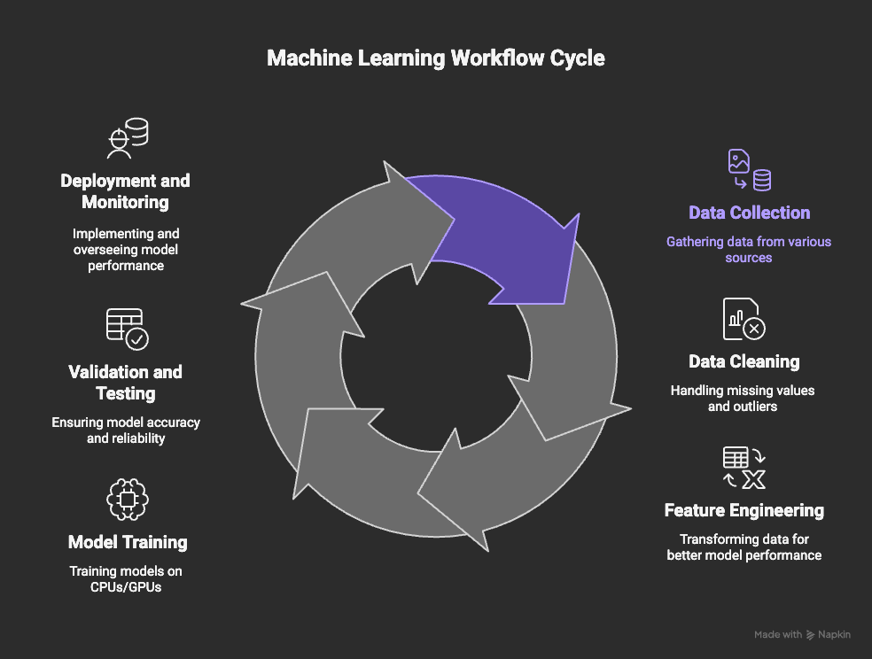

# Data Pipelines and the ML Workflow

## 1. What Are Data Pipelines?
Data pipelines are automated systems that move data across stages — collecting, transforming, enriching, and delivering it to downstream systems such as ML models, analytics engines, or storage layers.

### Key Characteristics
- **Ingestion** – Logs, events, databases, APIs, sensors  
- **Transformation** – Cleaning, normalization, enrichment  
- **Routing** – Moving data to warehouses, feature stores, ML systems  
- **Automation** – Scheduled or real-time workflows  
- **Scalability** – Handles massive, heterogeneous datasets  

---

## 2. The End-to-End ML Workflow

### Step 1: Data Collection
- Logs, metrics, events  
- Databases, APIs, data lakes  
- IoT/sensor streams  
- Third-party data sources  

### Step 2: Data Cleaning
- Handle missing values  
- Remove outliers  
- Normalize and standardize  
- Deduplicate and validate schema  
- Label and align datasets  

### Step 3: Feature Engineering
- Transform raw data into structured inputs  
- Domain-specific aggregations  
- Temporal and spatial features  
- Categorical encoding and embeddings  
- Feature selection and dimensionality reduction  

### Step 4: Model Training
- Use CPUs, GPUs, or TPUs  
- Supervised, unsupervised, or reinforcement learning  
- Hyperparameter tuning  
- Distributed training for large models  
- Model versioning and reproducibility  

### Step 5: Validation & Testing
- Evaluate on hold-out datasets  
- Bias and fairness detection  
- Performance metrics (Accuracy, F1, ROC-AUC, etc.)  
- Stress and drift testing  

### Step 6: Deployment & Monitoring
- Deploy as APIs, batch jobs, or streaming inference  
- Monitor performance degradation  
- Detect data, feature, and concept drift  
- Track latency, throughput, and costs  
- Implement feedback loops for retraining  

---

## 3. How Data Pipelines Enable ML
Data pipelines ensure:
- Reliable data quality  
- Consistent feature availability  
- Automated retraining workflows  
- Scalable ML operations  
- Traceability and lineage  

They connect the entire lifecycle:  
**Data Sources → Feature Store → Model Training → Deployment → Monitoring → Retraining**

---

## 4. Where This Applies in Modern AI Systems
This workflow supports:
- LLM training and fine-tuning  
- Recommendation engines  
- Fraud and anomaly detection  
- Predictive maintenance  
- Real-time inference applications  
- Retrieval-Augmented Generation (RAG) pipelines  

---

