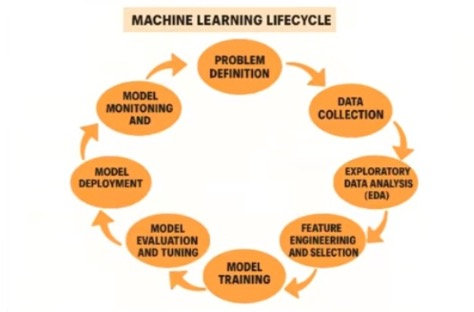

# Data Pipelines and the ML Workflow

Data quality and reproducibility are critical to successful ML.

## Typical ML Workflow

1. Data Collection (logs, events, APIs, sensors)
2. Data Cleaning (missing values, outliers, normalization)
3. Feature Engineering (domain-specific transformations)
4. Model Training (on CPUs/GPUs)
5. Validation and Testing
6. Deployment and Monitoring

Example command sequence:

    python 01_extract_data.py
    python 02_transform_data.py
    python 03_load_data.py
    python 04_train_model.py

