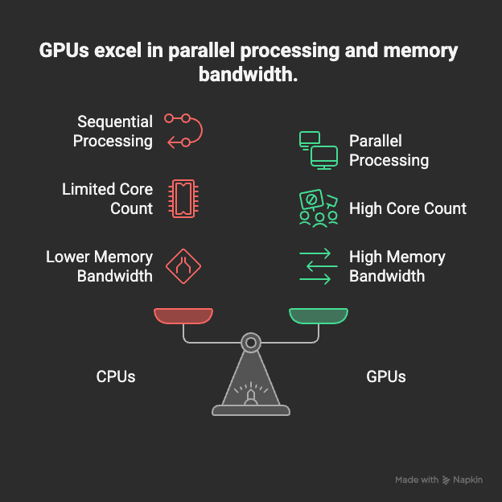

# Why GPUs Matter for AI

Deep learning relies heavily on large matrix and tensor operations.

AI workloads involve massive matrix operations. GPUs excel through:

- Thousands of cores executing simultaneous operations  
- High memory bandwidth feeding data to compute units  
- Tensor cores optimized for mixed-precision math  
- Specialized accelerators like TPUs and NPUs for inference  

Training large language models requires multi-GPU clusters with high-speed interconnects (NVLink, InfiniBand) to synchronize gradients across distributed systems.

Modern AI models, especially deep neural networks and transformers, require massive amounts of computation.  
GPUs (Graphics Processing Units) have become the backbone of AI because they are designed to handle large-scale parallel workloads efficiently.

---

## 1. Why Traditional CPUs Are Not Enough

CPUs are optimized for **sequential**, general-purpose processing.  
While they have powerful individual cores, they are not suited for the massive parallel computations needed for AI.

- CPUs typically have **4–64 cores**
- Designed for branching logic, operating systems, and serial tasks
- Limited throughput for matrix-heavy operations
- Poor scalability when dealing with billions of weights and activations

AI training involves repeated matrix multiplications — something CPUs are not built to perform efficiently.

---

## 2. How GPUs Accelerate Matrix Multiplications

Neural networks rely heavily on linear algebra, especially **matrix multiplications** (e.g., `W × X`).

GPUs excel because they:

- Have **thousands of smaller, efficient cores**
- Execute operations **in parallel**
- Pack more arithmetic units per chip than CPUs
- Are optimized for SIMD (Single Instruction, Multiple Data)

This means GPUs can compute millions of multiplications **simultaneously**, dramatically speeding up training and inference.

---

## 3. Tensor Cores and Mixed-Precision Computing

Modern GPUs (e.g., NVIDIA A100, H100) include **Tensor Cores**, specialized hardware units for deep learning.

Tensor Cores:

- Accelerate matrix operations used in AI
- Support **FP16**, **BF16**, and **FP8** precision
- Deliver several times the throughput of standard CUDA cores

### Mixed-precision computing
Training models using lower-precision formats while maintaining accuracy allows:

- Faster computation
- Lower memory usage
- Higher GPU utilization
- Better scaling in distributed training

Mixed precision is now a default for most large-scale AI training pipelines.

---

## 4. Why Multi-GPU Clusters Are Essential

Modern AI models are too large to train on a single GPU.

Multi-GPU systems use technologies like:

- **NVLink** – High-speed GPU-to-GPU interconnect
- **InfiniBand** – High-bandwidth, low-latency networking between servers
- **Distributed training frameworks** – PyTorch DDP, DeepSpeed, Horovod

These systems allow:

- Model parallelism (splitting the model across GPUs)
- Data parallelism (splitting the data across GPUs)
- Pipeline parallelism

Large models (LLMs, multimodal models) often use **hundreds or thousands of GPUs** simultaneously.

---

## 5. GPU Memory Bandwidth and Parallelism Enable Fast Inference

Inference requires rapid access to model weights and activations.

GPUs provide:

- Extremely high memory bandwidth  
  (e.g., H100 has **3 TB/s** bandwidth)
- Large on-chip memory (HBM)
- High throughput for real-time applications (e.g., chatbots, vision models)

This enables:

- Lower latency
- Higher throughput per dollar
- Efficient batching for large-scale services

GPUs allow AI models to serve millions of queries quickly and reliably.

---

## 6. GPUs vs TPUs vs NPUs

Modern AI compute involves several specialized accelerators:

### **GPUs**
- Most flexible and programmable  
- Best tool for training large and complex neural networks  
- Widely supported across ML frameworks  

### **TPUs (Tensor Processing Units)**
- Built by Google for deep learning  
- Extremely efficient for transformer training and inference  
- Optimized for large-scale Google Cloud workloads  

### **NPUs (Neural Processing Units)**
- Found in mobile and edge devices  
- Efficient for inference  
- Lower power consumption  

### Summary
- **GPUs** = Best for general-purpose deep learning (training + inference)  
- **TPUs** = Best for large-scale transformer workloads on Google’s ecosystem  
- **NPUs** = Best for on-device AI  

---
